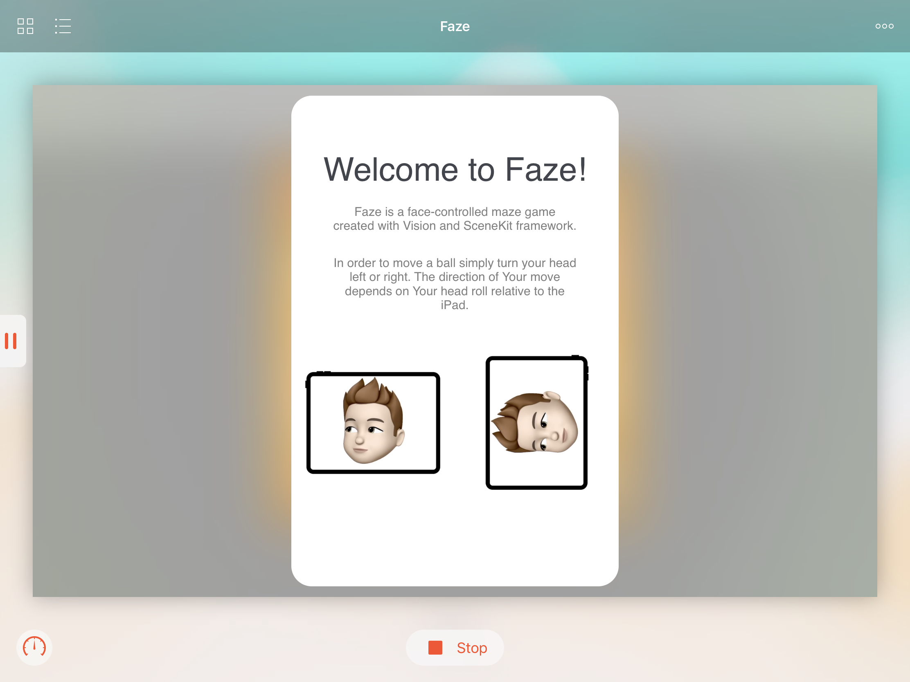

# Faze
My WWDC '19 scholarship submission created in Swift Playgrounds. Faze is a face-controlled maze game in which player must reach the end of a maze avoiding explosive barrels in a shortest time.

#### Technology stack:
- Swift 4.2
- XCode 10.1
- Swift Playgrounds 2.2

#### Libriares and frameworks used (all built in iOS 12 and newer):
- UIKit
- SceneKit
- SpriteKit
- Vision
- AVFoundation

#### To run:
1. Import the `Faze.playground` file onto Your iPad (for example with AirDrop, email or cloud) and open it with Swift Playgrounds
2. Click `Run My Code`

#### Screenshots

